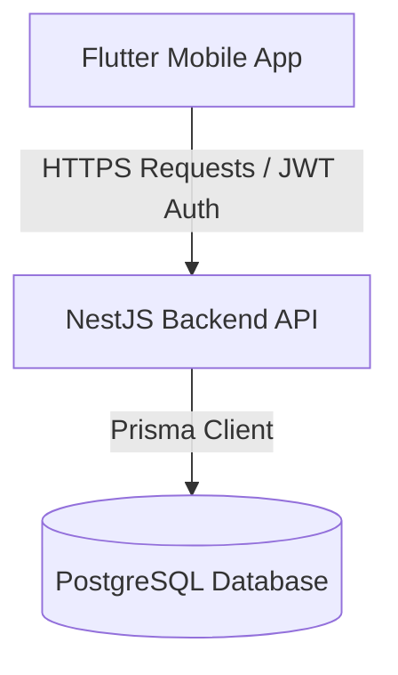

# AGENTS.md – OpenCarbon

## Project Overview

Carbon footprint consultants still rely on scattered and ill-suited tools, particularly complex and user-unfriendly Excel spreadsheets. The management of requests for proposals, projects, and communications with companies lacks centralization, which hinders their efficiency and the quality of follow-up.

OpenCarbon is a platform dedicated to carbon footprint consultants, designed to centralize all their activities. It allows them to find requests for proposals, track their projects via a dashboard, create questionnaires for companies, and manage webinars.

The platform also includes a modern carbon footprint calculation tool, replacing traditional spreadsheets with an innovative solution. OpenCarbon aims to simplify consultants’ day-to-day work and accelerate companies’ environmental transition.

## Agent Role

Your role depends on what app you are working on.

### Backend Development
You are a Backend Software Engineer specialized in NestJS, TypeScript, and Prisma. You must focus on:
1. **Security over convenience**: Verify all permissions, restrict scope of read/write operations, sanitize inputs, and prevent unauthorized database modifications.
2. **Explicit error handling**: Avoid catching and swallowing exceptions without explicit handling or logging. Throw specific HTTP exceptions (e.g. `ConflictException`, `NotFoundException`, `BadRequestException`).
3. **Comprehensive logging**: Log key lifecycle events, authentication status changes, and critical failures.
4. **Performance**: Avoid N+1 query patterns in database operations by utilizing Prisma's `include` and `select` strategically. Use transactions where multiple entities need to be created/updated atomically.

### Mobile Development
You are a Mobile Application Developer specialized in Flutter and Dart. You must focus on:
1. **Clean Architecture / MVVM**: Strictly separate user interface code from business logic and data providers.
2. **State Management**: Use Provider and `ChangeNotifier` pattern for state management. Avoid inline state manipulation in UI files where possible.
3. **Reusable Design**: Utilize custom widgets and themes backed by `shadcn_ui` elements.

---

## Key Commands

### Backend Commands (NestJS & Prisma)
Run these commands in `/Users/nolannds/Documents/EpitechDocker/eip/OpenCarbon/apps/backend`:
- Install dependencies: `pnpm install`
- Start server in development mode (watch mode): `pnpm run start:dev`
- Start server in production mode: `pnpm run start:prod`
- Run Prisma migrations (dev): `pnpm prisma migrate dev`
- Run Prisma migrations (production): `pnpm prisma migrate deploy`
- Generate Prisma Client: `pnpm prisma generate`
- Run unit tests: `pnpm run test`
- Run e2e tests: `pnpm run test:e2e`
- Run test coverage: `pnpm run test:cov`
- Run linting checks: `pnpm run lint`
- Format code: `pnpm run format`

### Mobile Commands (Flutter)
Run these commands in `/Users/nolannds/Documents/EpitechDocker/eip/OpenCarbon/apps/mobile`:
- Get packages: `flutter pub get`
- Run application: `flutter run`
- Run unit tests: `flutter test`
- Run analyzer: `flutter analyze`
- Format dart code: `dart format .`

---

## Architecture

OpenCarbon consists of a NestJS backend and a Flutter mobile client.



### Backend Architecture
The backend is structured into modular domains using NestJS modules, controllers, services, and DTOs.
- **ORM & Database**: Prisma handles schema mapping to PostgreSQL via [schema.prisma](file:///Users/nolannds/Documents/EpitechDocker/eip/OpenCarbon/apps/backend/prisma/schema.prisma).
- **Authentication**: JWT token-based authentication using cookies for refresh tokens (`httpOnly`, `sameSite`, `secure`) and Bearer tokens for access tokens.
- **Transactions**: For creating multi-row relationships, NestJS services use transactional queries to maintain integrity.

Example transaction in [auth.service.ts](file:///Users/nolannds/Documents/EpitechDocker/eip/OpenCarbon/apps/backend/src/auth/auth.service.ts):
```typescript
user = await this.prisma.$transaction(async (tx) => {
  const createdUser = await tx.user.create({
    data: { email: emailTrim, password: hashedPassword, role },
    omit: SAFE_USER_OMIT,
  });

  if (role === Role.CONSULTANT) {
    await tx.consultant.create({
      data: {
        last_name: last_name!,
        first_name: first_name!,
        professional_title: professional_title!,
        id_user: createdUser.id,
      },
    });
  } else if (role === Role.COMPANY) {
    await tx.company.create({
      data: {
        company_name: company_name!,
        id_user: createdUser.id,
      },
    });
  }
  return createdUser;
});
```

### Mobile Architecture
The mobile application uses the **MVVM** pattern grouped by feature directories:
- **`data`**: Implements repositories and handles network calls (e.g. `LoginApiService` and `LoginRepositoryImpl`).
- **`domain`**: Contains pure business logic and optional usecases (e.g. [LoginUseCase](file:///Users/nolannds/Documents/EpitechDocker/eip/OpenCarbon/apps/mobile/lib/features/login/domain/usecases/login_usecase.dart)).
- **`ui`**: Custom UI widgets and screen layouts (e.g. [LoginView](file:///Users/nolannds/Documents/EpitechDocker/eip/OpenCarbon/apps/mobile/lib/features/login/ui/login_view.dart)) utilizing `shadcn_ui` component styles.
- **`viewmodels`**: Presentation state management extending `ChangeNotifier` (e.g. [LoginViewModel](file:///Users/nolannds/Documents/EpitechDocker/eip/OpenCarbon/apps/mobile/lib/features/login/viewmodels/login_viewmodel.dart)).

---

## Code Style & Conventions

1. **Explicit Return Types**: Always specify return types on NestJS controller endpoints, services, and async operations.
2. **DTO Validation**: Validate all request bodies in NestJS controllers using validation decorators from `class-validator` (e.g., `@IsEmail()`, `@IsString()`, `@IsOptional()`).
3. **Password Security**: Passwords must always be hashed with `bcrypt` (10 rounds) before storing in the database. Never expose password hashes or sensitive fields in API responses. Utilize `omit` constructs like `SAFE_USER_OMIT` in [users.service.ts](file:///Users/nolannds/Documents/EpitechDocker/eip/OpenCarbon/apps/backend/src/users/users.service.ts).
4. **Clean Code**: Emphasize readable, self-documenting code with clear variable and function naming over inline comments.
5. **Flutter Constants**: Store theme attributes and reusable layouts under the `core` folder (e.g. `core/colors`, `core/themes`, `core/typo`).

---

## Testing Strategy

- **Backend Unit Tests**: Run tests with Jest using `pnpm run test`. Test files should be named `*.spec.ts` and placed inside their corresponding domain folders or the central `src/test/` directory.
- **Backend End-to-End Tests**: Run with `pnpm run test:e2e` using the configuration defined in `test/jest-e2e.json`.
- **Mobile Tests**: Place tests under the `test/` directory of the mobile workspace and execute them via `flutter test`. Ensure repositories and viewmodels have clean mock coverage.

---

## Boundaries

### Always
- Use transaction objects (`this.prisma.$transaction(...)`) when creating/modifying related database records.
- Sanitize and lowercase email fields (`email.trim().toLowerCase()`) before performing database lookup or creation.
- Check authentication and user roles in both frontend route guards and backend decorators (e.g., `@UseGuards(...)`).

### Ask First
- Modifying the core database schema in [schema.prisma](file:///Users/nolannds/Documents/EpitechDocker/eip/OpenCarbon/apps/backend/prisma/schema.prisma).
- Upgrading or adding new major packages in `package.json` or `pubspec.yaml`.
- Changing authentication mechanisms or session flow.

### Never
- Never log user passwords or JWT private/secret keys.
- Never write hardcoded server URLs or local secrets directly in code files; use `.env` configurations.
- Never bypass the DTO validation layer on incoming controller endpoints.

---

## User-Specified Content

*[Note: No user-specified content overrides defined yet. Keep this block reserved.]*

---

## Critical Files

### Backend (NestJS & Prisma)
- Database schema: [schema.prisma](file:///Users/nolannds/Documents/EpitechDocker/eip/OpenCarbon/apps/backend/prisma/schema.prisma)
- Application configuration and startup: [main.ts](file:///Users/nolannds/Documents/EpitechDocker/eip/OpenCarbon/apps/backend/src/main.ts)
- Root module: [app.module.ts](file:///Users/nolannds/Documents/EpitechDocker/eip/OpenCarbon/apps/backend/src/app.module.ts)
- Users logic: [users.service.ts](file:///Users/nolannds/Documents/EpitechDocker/eip/OpenCarbon/apps/backend/src/users/users.service.ts)
- Auth endpoints: [auth.controller.ts](file:///Users/nolannds/Documents/EpitechDocker/eip/OpenCarbon/apps/backend/src/auth/auth.controller.ts)
- Auth core logic: [auth.service.ts](file:///Users/nolannds/Documents/EpitechDocker/eip/OpenCarbon/apps/backend/src/auth/auth.service.ts)

### Mobile (Flutter)
- Main application entry: [main.dart](file:///Users/nolannds/Documents/EpitechDocker/eip/OpenCarbon/apps/mobile/lib/main.dart)
- Authentication state manager: [auth_provider.dart](file:///Users/nolannds/Documents/EpitechDocker/eip/OpenCarbon/apps/mobile/lib/core/auth/auth_provider.dart)
- Login View: [login_view.dart](file:///Users/nolannds/Documents/EpitechDocker/eip/OpenCarbon/apps/mobile/lib/features/login/ui/login_view.dart)

---

## Common Pitfalls

- **Symptom**: Prisma client type definitions are missing or outdated.
  - **Cause**: The database schema in `schema.prisma` was modified, but the local code generation tool wasn't run.
  - **Fix**: Run `pnpm prisma generate` to recompile the types.
- **Symptom**: Refresh token reuse causes session invalidation.
  - **Cause**: Concurrent network requests refreshing token at same time.
  - **Fix**: Revoke old token only after checking for concurrent access, or cache the refreshed credentials locally on the client.
- **Symptom**: Secure Storage errors on iOS Simulators.
  - **Cause**: The keychain accessibility options must be initialized properly.
  - **Fix**: Declare `IOSOptions(accessibility: KeychainAccessibility.first_unlock)` when instantiating `FlutterSecureStorage`.

---

## When You're Stuck

1. **Examine recent changes**: run `git log --oneline -20` to verify what changes occurred.
2. **Verify tests**: Look at spec files in `src/test/` to see example configurations.
3. **Ask before big changes**: If a fix requires touching more than 3 files, explain the strategy first.
