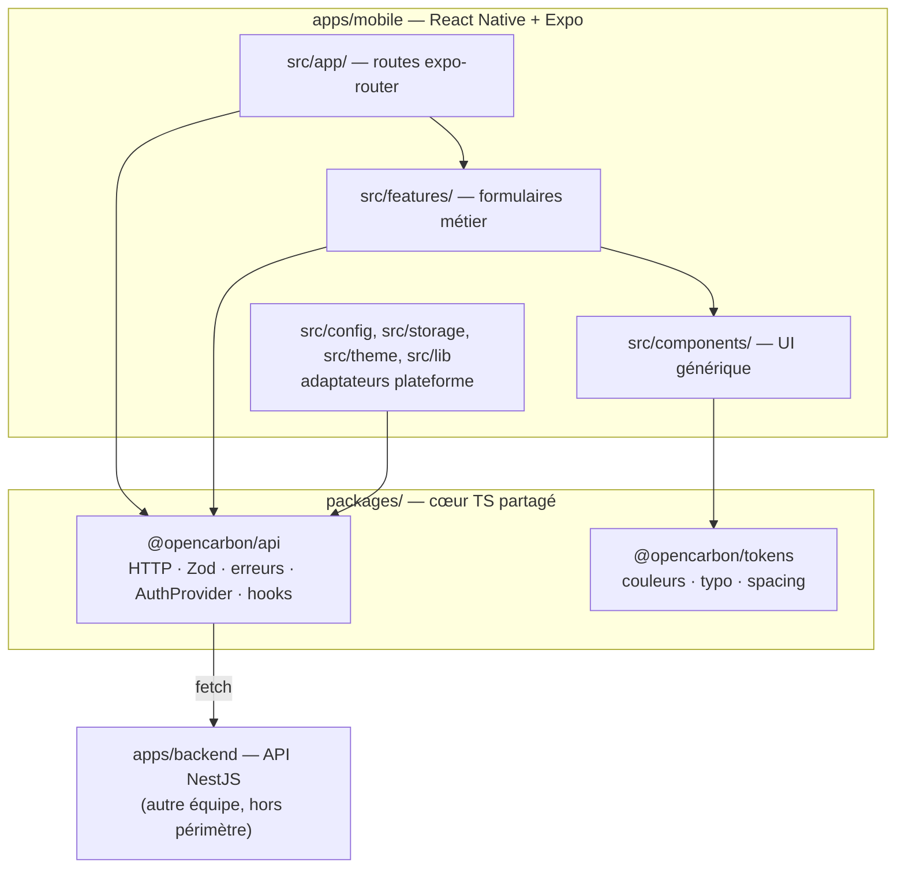
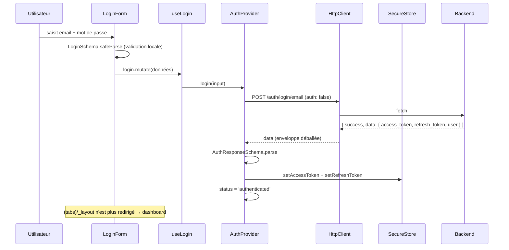

# Architecture — application mobile OpenCarbon

Document de référence pour relire la migration Flutter → React Native et pour prendre la main sur le code.

Il décrit **ce qui existe réellement dans la branche**, y compris ce qui est encore un stub. Les points qui méritent
une décision ou une correction sont regroupés en fin de document, section [Points de revue](#points-de-revue) —
ils ne sont pas dilués dans le texte.

---

## 1. Vue d'ensemble

L'app mobile est volontairement **mince**. Toute la logique réutilisable (HTTP, validation, session, design tokens)
vit dans `packages/*`, partagé avec le futur front web Next.js. `apps/mobile` ne contient que du rendu et de la
navigation.



**La règle structurante :** un écran n'importe jamais un fichier de `packages/` par chemin relatif, uniquement via
`@opencarbon/api` ou `@opencarbon/tokens`. C'est ce qui garantit que l'UI restera extractible et que le web pourra
réutiliser le cœur sans copier-coller. La règle est appliquée mécaniquement par ESLint
(`import/no-relative-packages`, [eslint.config.mjs](../../eslint.config.mjs)) — ce n'est pas une convention de bonne
volonté, ça casse la CI.

Inversement, `packages/api` ne connaît **rien** de React Native : pas d'`expo-*`, pas de lecture d'`process.env`.
Tout ce qui est spécifique à la plateforme lui est **injecté** (voir §4).

---

## 2. Arborescence

```
apps/mobile/src/
├── app/                      # routes expo-router (file-based routing)
│   ├── _layout.tsx           # racine : providers, polices, splash
│   ├── index.tsx             # aiguillage selon l'état de session
│   ├── (auth)/               # groupe non authentifié
│   │   ├── _layout.tsx       #   garde : si connecté → (tabs)
│   │   ├── login.tsx
│   │   └── register.tsx
│   └── (tabs)/               # groupe authentifié, barre d'onglets
│       ├── _layout.tsx       #   garde : si non connecté → (auth)/login
│       ├── dashboard.tsx     #   stub
│       ├── offers.tsx        #   stub
│       ├── messages.tsx      #   stub
│       └── profile.tsx       #   implémenté (identité + déconnexion)
├── components/               # UI générique, sans logique métier
│   ├── Button.tsx  TextField.tsx  ScreenContainer.tsx
│   ├── TabIcon.tsx           # SVG bi-état (stroke / filled)
│   └── Placeholder.tsx       # écran « Bientôt disponible »
├── features/auth/            # composition métier
│   ├── LoginForm.tsx  RegisterForm.tsx  RoleToggle.tsx
├── config/env.ts             # lecture + validation de EXPO_PUBLIC_API_BASE_URL
├── lib/queryClient.ts        # instance React Query
├── storage/                  # adaptateur expo-secure-store → TokenStorage
├── theme/useTheme.ts         # sélection light/dark selon le système
└── svg.d.ts                  # typage des imports .svg
```

Le découpage `components` / `features` est net : **`components/` ne sait rien du métier** (ni auth, ni offre, ni
utilisateur) et ne dépend que de `@opencarbon/tokens`. Toute la connaissance métier est dans `features/` et dans
`packages/api`. Un composant qui aurait besoin d'un `user` ou d'un `Role` n'a rien à faire dans `components/`.

---

## 3. `@opencarbon/tokens` — le design system

Package sans dépendance, purement déclaratif. Valeurs portées depuis l'app Flutter (`app_colors.dart`,
`app_typography.dart`, `app_sizes.dart`) pour que la charte ne bouge pas pendant la migration.

| Fichier                                                  | Contenu                                                                  |
| -------------------------------------------------------- | ------------------------------------------------------------------------ |
| [colors.ts](../../packages/tokens/src/colors.ts)         | `lightColors`, `darkColors`, `semanticColors` (success/warning/danger)   |
| [typography.ts](../../packages/tokens/src/typography.ts) | Échelle de 12 styles, Anton pour les titres, Poppins pour le corps       |
| [spacing.ts](../../packages/tokens/src/spacing.ts)       | `spacing` (xs→xl) et `radius` (sm/md/full)                               |
| [theme.ts](../../packages/tokens/src/theme.ts)           | Assemble `lightTheme` / `darkTheme`, exporte `themes` et le type `Theme` |

Côté app, un seul point d'accès : [useTheme.ts](src/theme/useTheme.ts), qui lit `useColorScheme()` de React Native
et renvoie le thème correspondant. Les composants font `const theme = useTheme()` puis appliquent les valeurs
inline. **Il n'y a pas de `ThemeProvider`** — le hook lit directement l'API système.

Le dark mode est donc déjà câblé de bout en bout, mais la palette sombre n'a pas été relue visuellement (voir
points de revue).

---

## 4. `@opencarbon/api` — le cœur partagé

Deux points d'entrée distincts, et c'est délibéré :

- **`@opencarbon/api`** — barrel « pur ». Aucun import React. Importable depuis un Server Component Next, un script
  Node, ou un test.
- **`@opencarbon/api/react`** — hooks et contexte. Nécessite `react` + `@tanstack/react-query`, tous deux déclarés en
  `peerDependencies` **optionnelles** pour que le barrel pur reste consommable sans eux.

### 4.1 Couche HTTP

[`HttpClient`](../../packages/api/src/http/http-client.ts) est une classe instanciée une fois par `AuthProvider`.
Responsabilités :

1. Préfixe `baseUrl`, sérialise le JSON, pose `Accept` / `Content-Type`.
2. Injecte `Authorization: Bearer <access_token>` lu depuis le `TokenStorage` (désactivable par `auth: false`).
3. Passe `credentials: 'include'` — inutile en natif, indispensable pour le cookie httpOnly du web.
4. **Sur 401 : refresh puis retry une seule fois.** Le retry force `retryOnUnauthorized: false`, ce qui rend la
   récursion impossible.
5. **Refresh single-flight** : plusieurs requêtes qui se prennent un 401 en même temps partagent une seule promesse
   de refresh (`this.refreshing ??= …`), au lieu de déclencher N appels concurrents à `/auth/refresh`.
6. Si le refresh échoue, appelle `onLogout()` et lève une `AuthFailure`.
7. **Déballe l'enveloppe** `{ success, data, message }` du backend et ne renvoie que `data` à l'appelant.

### 4.2 Erreurs typées

[`errors.ts`](../../packages/api/src/http/errors.ts) définit une hiérarchie qui reprend l'esprit des `AppErrors`
Flutter : `AuthFailure` (401), `UnauthorizedFailure` (403), `ValidationFailure` (400/422, porte la liste des
`issues`), `NotFoundFailure`, `ServerFailure` (5xx), `NetworkFailure` (pas de réponse), `EnvironmentFailure` (config
manquante). `mapHttpError(status, body)` fait la traduction.

Bénéfice concret : l'UI peut faire `if (err instanceof ValidationFailure)` au lieu de comparer des codes, et le même
mapping servira au web.

### 4.3 Schémas Zod

[`schemas/`](../../packages/api/src/schemas/) miroite les modèles Prisma et les DTO du backend. Deux partis pris :

- **Tolérant en lecture** — `.passthrough()` et `.nullish()` partout sur les entités, pour qu'un champ ajouté côté
  backend ne fasse pas planter l'app en production.
- **Strict en écriture** — `RegisterSchema` est une **union discriminée sur `role`**, ce qui reproduit côté client
  les `@ValidateIf` du backend : un consultant doit fournir `first_name`/`last_name`/`professional_title`, une
  entreprise `company_name`. Le mauvais champ ne compile même pas.

État : `user` et `auth` sont complets et utilisés. `offer` et `application` sont des **stubs** structurés mais
jamais appelés — ils attendent les features correspondantes.

### 4.4 Session — `AuthProvider`

[`AuthProvider.tsx`](../../packages/api/src/react/AuthProvider.tsx) est la pièce centrale. Il reçoit **deux
injections** de l'app hôte, et c'est ce qui rend le package agnostique :

| Prop      | Fourni par le mobile                                                                 |
| --------- | ------------------------------------------------------------------------------------ |
| `baseUrl` | [`src/config/env.ts`](src/config/env.ts) → `expo-constants` → `app.config.ts`        |
| `storage` | [`secure-store-adapter.ts`](src/storage/secure-store-adapter.ts) → Keychain/Keystore |

Le web injectera une base URL Next et un storage où le refresh est un no-op (cookie httpOnly).

Il expose un état à trois valeurs — `loading` | `authenticated` | `guest` — plus `user`, `client`, et les actions
`login` / `register` / `logout`.

**Hydratation au démarrage** : au montage, si un access token existe en SecureStore, il appelle `/users/me`. Succès →
`authenticated`. Échec → purge du storage et `guest`. C'est pour ça que l'état `loading` existe : sans lui, un
utilisateur déjà connecté verrait l'écran de login clignoter le temps de la lecture asynchrone du Keychain.

`client` est exposé volontairement : les futures features (offres, messages) doivent réutiliser **cette** instance
de `HttpClient`, pas en créer une autre — sinon elles perdent le refresh single-flight et le callback de logout.

### 4.5 Hooks

[`hooks.ts`](../../packages/api/src/react/hooks.ts) enveloppe les actions du contexte dans React Query, ce qui donne
gratuitement `isPending` / `isError` / `error` aux formulaires : `useLogin`, `useRegister`, `useLogout`, `useMe`.

Les clés de cache sont centralisées dans [`query-keys.ts`](../../packages/api/src/react/query-keys.ts) — pas de
chaîne magique dans les composants. Les entrées `offers` sont déjà prévues.

---

## 5. Le flux d'authentification, de bout en bout



Trois niveaux de validation successifs, chacun avec un rôle distinct :

1. **Zod côté formulaire** (`safeParse`) — feedback immédiat, aucun aller-retour réseau.
2. **Backend** — la seule autorité, renvoie 400/422 mappé en `ValidationFailure`.
3. **Zod sur la réponse** (`AuthResponseSchema.parse`) — contrat de sortie. Si le backend change sa forme, on le sait
   tout de suite au lieu de propager un `undefined` dans l'app.

### Refresh de token

En natif il n'y a pas de cookie jar. Le `refresh_token` est donc **persisté en SecureStore** et renvoyé
explicitement dans le body de `/auth/refresh`. Le backend accepte les deux formes — le décorateur
[`RefreshToken`](../../apps/backend/src/decorators/refresh-token.ts) lit `cookies.refresh_token ?? body.refresh_token`.
C'est ce qui permet à la même couche HTTP de servir le mobile et le web.

Même mécanique pour `/auth/logout`, qui est **volontairement non gardé** côté backend — d'où le `auth: false` dans
[`auth.service.ts`](../../packages/api/src/services/auth.service.ts). Ce n'est pas un oubli.

---

## 6. Navigation

`expo-router` fait du routing par fichiers : l'arborescence de `src/app/` **est** la table de routes. Les dossiers
entre parenthèses sont des _groupes_ — ils structurent la navigation sans apparaître dans l'URL.

La protection des routes repose sur trois gardes complémentaires :

| Fichier                                              | Comportement                                                 |
| ---------------------------------------------------- | ------------------------------------------------------------ |
| [`index.tsx`](src/app/index.tsx)                     | `loading` → spinner ; `authenticated` → tabs ; sinon → login |
| [`(auth)/_layout.tsx`](<src/app/(auth)/_layout.tsx>) | Si `authenticated` → renvoie vers les tabs                   |
| [`(tabs)/_layout.tsx`](<src/app/(tabs)/_layout.tsx>) | Si `≠ authenticated` → renvoie vers le login                 |

Le point d'entrée déclaré est `expo-router/entry` (champ `main` du `package.json`), et
`experiments.typedRoutes: true` dans [app.config.ts](app.config.ts) génère `.expo/types/router.d.ts` — les `href`
sont donc **typés** : une route inexistante est une erreur de compilation.

---

## 7. Couche de rendu

### Layout racine

[`_layout.tsx`](src/app/_layout.tsx) empile les providers dans un ordre qui n'est pas interchangeable :

```
SafeAreaProvider
└── QueryClientProvider        ← AuthProvider appelle useQueryClient()
    └── AuthProvider           ← tout le reste consomme useAuthContext()
        └── Slot               ← la route courante
```

Il gère aussi le chargement des polices (`useFonts`) et retient le splash screen tant qu'elles ne sont pas prêtes
(`preventAutoHideAsync` / `hideAsync`) — sans ça, on verrait un flash de police système.

### Composants

Tous suivent le même moule : props typées, `useTheme()` pour les couleurs, `StyleSheet.create` pour le statique,
style inline pour ce qui dépend du thème. `Button` gère `loading` (spinner) et `disabled` ; `TextField` gère l'état
`error` (bordure + message).

### Icônes SVG

Chaîne un peu inhabituelle, à connaître avant de toucher aux assets :

1. `react-native-svg-transformer` est branché dans [metro.config.js](metro.config.js), et `svg` est **retiré** de
   `assetExts` puis ajouté à `sourceExts` — un `.svg` devient un module JS, pas une image.
2. [`svg.d.ts`](src/svg.d.ts) déclare `*.svg` comme composant React. Fichier **séparé** de `expo-env.d.ts`, qu'Expo
   régénère et écraserait.
3. Les SVG utilisent `currentColor`, donc la prop `color` de `react-native-svg` suffit à les teinter — pas besoin de
   dupliquer un asset par couleur. [`TabIcon`](src/components/TabIcon.tsx) exploite ça pour l'état focus.

---

## 8. Configuration et outillage

### Config runtime

`EXPO_PUBLIC_API_BASE_URL` → [`app.config.ts`](app.config.ts) (clé `extra`) → `expo-constants` →
[`src/config/env.ts`](src/config/env.ts), qui **lève une `EnvironmentFailure` au démarrage** si la valeur manque.
Échec immédiat et lisible, plutôt qu'un `fetch` vers `undefined/auth/login/email` trois écrans plus loin.

Aucun `.env` n'est embarqué comme asset — c'était un défaut du POC Flutter, corrigé ici.

### Chaîne de build

| Élément                                        | Rôle                                                                         |
| ---------------------------------------------- | ---------------------------------------------------------------------------- |
| [metro.config.js](metro.config.js)             | `watchFolders` sur la racine + `nodeModulesPaths` pour résoudre `packages/*` |
| [babel.config.js](babel.config.js)             | `babel-preset-expo` seul — il gère aussi les alias `paths` du tsconfig       |
| [tsconfig.json](tsconfig.json)                 | Alias `@/*`, `@assets/*`, `@opencarbon/*`                                    |
| [tsconfig.base.json](../../tsconfig.base.json) | `strict` **et** `noUncheckedIndexedAccess`                                   |
| [eslint.config.mjs](../../eslint.config.mjs)   | `import/no-relative-packages`, type-imports inline, Prettier                 |
| [turbo.json](../../turbo.json)                 | Orchestration `lint` / `typecheck` / `test`                                  |

Les packages partagés sont consommés **en TypeScript source** (`main: ./src/index.ts`), sans étape de build : Metro
et `tsc` les compilent à la volée. Un package modifié est immédiatement visible dans l'app, sans watcher séparé.

`noUncheckedIndexedAccess` mérite d'être signalé : tout accès indexé renvoie `T | undefined`. C'est pour ça qu'on
lit `parsed.error.issues[0]?.message ?? 'Champs invalides'` dans les formulaires. Ce n'est pas de la paranoïa
gratuite, c'est le compilateur qui l'exige.

---

## 9. Contrat avec le backend

Le backend est maintenu par une autre partie de l'équipe. **On le consomme, on ne le modifie pas sans
coordination.**

| Méthode | Endpoint               | Gardé | Utilisé par                      |
| ------- | ---------------------- | ----- | -------------------------------- |
| POST    | `/auth/register/email` | non   | `authService.register`           |
| POST    | `/auth/login/email`    | non   | `authService.login`              |
| POST    | `/auth/refresh`        | oui   | `HttpClient.doRefresh` (interne) |
| POST    | `/auth/logout`         | non   | `authService.logout`             |
| GET     | `/users/me`            | oui   | `authService.me`, hydratation    |

Toutes les réponses sont enveloppées en `{ success, data, message }`, et les erreurs normalisées en
`{ statusCode, message }` par le `HttpExceptionFilter`. Le déballage est centralisé dans `HttpClient.parse` — aucun
appelant ne manipule l'enveloppe.

> À noter : le POC Flutter tapait `/auth/login`. Les vrais endpoints sont suffixés `/email`. Le commentaire dans
> `auth.service.ts` le rappelle explicitement pour éviter la régression.

---

## 10. État réel de l'implémentation

| Domaine                         | État                                               |
| ------------------------------- | -------------------------------------------------- |
| Design tokens + dark mode       | ✅ complet, câblé                                  |
| Couche HTTP + erreurs           | ✅ complet (refresh single-flight, retry, mapping) |
| Auth (login/register/me)        | ✅ complet de bout en bout                         |
| Session + persistance           | ✅ complet (SecureStore, hydratation au boot)      |
| Navigation + gardes             | ✅ complet, routes typées                          |
| Écran profil                    | ✅ identité + déconnexion                          |
| Dashboard / Missions / Messages | 🚧 `<Placeholder />` — « Bientôt disponible »      |
| Schémas `offer` / `application` | 🚧 stubs Zod prêts, aucun service ni hook          |
| Tests                           | ❌ aucun — le script `test` est un `echo`          |
| Build natif (EAS, icônes)       | ❌ non configuré — Expo Go uniquement              |

Le squelette est complet et cohérent ; ce qui manque, ce sont les features métier par-dessus. Pour en ajouter une,
le chemin est balisé : schéma Zod → service → hook → écran.

---

## Points de revue

Relevé en lisant le code. Rien ici n'est bloquant pour la branche — ce sont des sujets à trancher, classés par
importance.

### À regarder en priorité

1. **Deep link pendant l'hydratation.** [`(tabs)/_layout.tsx`](<src/app/(tabs)/_layout.tsx>) teste
   `status !== 'authenticated'`, ce qui inclut `loading`. Un utilisateur connecté qui ouvre un lien direct vers un
   onglet sera renvoyé au login le temps de la lecture SecureStore, puis ramené. `index.tsx` gère bien ce cas, pas
   les layouts de groupe. Un `if (status === 'loading') return null;` dans les deux `_layout` de groupe suffirait.

2. **Effet de bord pendant le rendu.** Dans [`AuthProvider.tsx`](../../packages/api/src/react/AuthProvider.tsx),
   `resetSession.current = () => {…}` est affecté dans le corps du composant, hors `useEffect`. Ça fonctionne
   aujourd'hui mais viole les règles de pureté du rendu React et devient réellement risqué en mode concurrent.
   Un `useCallback` + `useEffect` d'assignation lèverait l'ambiguïté.

3. **Déballage d'enveloppe trop permissif.** `HttpClient.parse` fait `'data' in body` pour décider de déballer. Un
   futur endpoint dont la réponse _nue_ contiendrait légitimement une clé `data` serait mal interprété. Tester
   `'success' in body && 'data' in body` serait plus sûr.

### Moins urgent

4. **Aucun test.** Le socle le plus rentable à couvrir en premier : `mapHttpError`, le refresh single-flight de
   `HttpClient`, et `RegisterSchema` (l'union discriminée). Ce sont des fonctions pures sans dépendance native, donc
   testables sans harnais React Native.

5. **`useMe` avec `initialData`.** Combiné à `staleTime: 30_000`, la donnée initiale est considérée fraîche : le
   hook ne refetchera pas avant 30 s. C'est probablement le comportement voulu, mais autant l'acter.

6. **Dark mode jamais relu visuellement.** La palette sombre est câblée et fonctionnelle, mais `darkColors.text`
   vaut `#1C1C1C` (sombre) sur `background` `#182C24` (sombre aussi) — à vérifier sur écran, notamment le contraste
   du label des boutons.

7. **Champ `description` absent de l'inscription.** Il est optionnel dans `RegisterSchema` pour les deux rôles, mais
   [`RegisterForm`](src/features/auth/RegisterForm.tsx) ne l'expose pas. Volontaire ou oubli ?

8. **Messages d'erreur bruts.** `login.error.message` affiche directement le message du backend. Acceptable en dev,
   à repasser avant une démo publique.

9. **Pas de configuration de build natif.** [app.config.ts](app.config.ts) n'a ni `ios.bundleIdentifier`, ni
   `android.package`, ni icône, ni splash. Sans conséquence pour Expo Go, bloquant dès qu'on voudra un build EAS.

---

## Pour démarrer

Voir [README.md](README.md) — installation, `.env` selon la cible (simulateur / émulateur / téléphone), et la
procédure de réinstallation propre après un changement de version d'Expo SDK.
